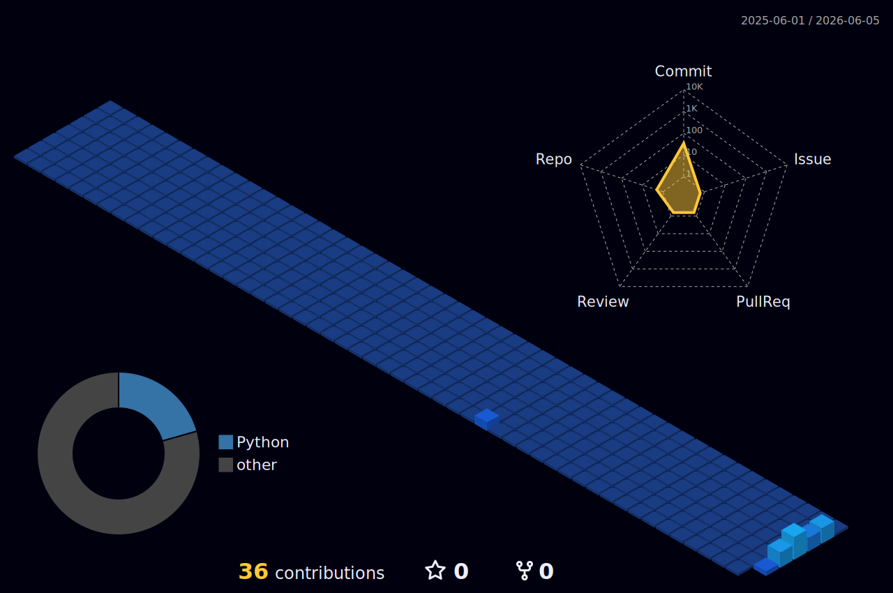

.png)

I'm a student developer. I started by learning HTML and CSS with my teacher at school. Then I took a Python course, after which there was C++ and Java app development with my friend. This year, I've been diving into AI agents using Python and studying computer networks.
* 🌍  I'm based in Moscow
* 🚀  I'm currently working on [Vibe Player](https://github.com/amax3se/vibe-player)
* 🧠  I'm currently learning C# and Cybersecurity now
* 💬  I use tabs over spaces

## Skills
<p align="left">
<a href="https://docs.microsoft.com/en-us/cpp/?view=msvc-170" target="_blank" rel="noreferrer"></a><a href="https://docs.microsoft.com/en-us/dotnet/csharp/" target="_blank" rel="noreferrer"></a><a href="https://git-scm.com/" target="_blank" rel="noreferrer"></a><a href="https://www.oracle.com/java/" target="_blank" rel="noreferrer"></a><a href="https://developer.mozilla.org/en-US/docs/Web/JavaScript" target="_blank" rel="noreferrer"></a><a href="https://www.python.org/" target="_blank" rel="noreferrer"></a><a href="https://code.visualstudio.com/" target="_blank" rel="noreferrer"></a><a href="https://developer.mozilla.org/en-US/docs/Glossary/HTML5" target="_blank" rel="noreferrer"></a><a href="https://www.w3.org/TR/CSS/#css" target="_blank" rel="noreferrer"></a><a href="https://www.adobe.com/uk/products/photoshop.html" target="_blank" rel="noreferrer"></a><a href="https://www.docker.com/" target="_blank" rel="noreferrer"></a>
</p>

## Socials
<p align="left"> 
  <a href="https://www.github.com/amax3se" target="_blank" rel="noreferrer"> 
    <picture> 
      <source media="(prefers-color-scheme: dark)" srcset="https://raw.githubusercontent.com/danielcranney/readme-generator/main/public/icons/socials/github-dark.svg" /> 
      <source media="(prefers-color-scheme: light)" srcset="https://raw.githubusercontent.com/danielcranney/readme-generator/main/public/icons/socials/github.svg" /> 
       
    </picture> 
  </a> 
  <a href="https://open.spotify.com/user/31ho4vfscgelliu6un7b3zpj4wou?si=224724e738464859" target="_blank" rel="noreferrer"> 
    <picture> 
      <source media="(prefers-color-scheme: dark)" srcset="https://www.readmecodegen.com/api/social-icon?name=spotify&size=96" /> 
      <source media="(prefers-color-scheme: light)" srcset="https://www.readmecodegen.com/api/social-icon?name=spotify&size=96&theme=github&color=%23000000" /> 
       
    </picture> 
  </a>
  <a href="https://www.reddit.com/user/Amaxese/" target="_blank" rel="noreferrer"> 
    <picture> 
      <source media="(prefers-color-scheme: dark)" srcset="https://www.readmecodegen.com/api/social-icon?name=reddit&size=96" /> 
      <source media="(prefers-color-scheme: light)" srcset="https://www.readmecodegen.com/api/social-icon?name=reddit&size=96" /> 
       
    </picture> 
  </a>
</p>

## My Stats


<!--START_SECTION:waka-->


**🐱 My GitHub Data** 

> 📦 922 Bytes Used in GitHub's Storage 
 > 
> 🏆 139 Contributions in the Year 2026
 > 
> 🚫 Not Opted to Hire
 > 
> 📜 6 Public Repositories 
 > 
> 🔑 0 Private Repositories 
 > 
**I'm an Early 🐤** 

```text
🌞 Morning                32 commits          █████░░░░░░░░░░░░░░░░░░░░   21.05 % 
🌆 Daytime                69 commits          ███████████░░░░░░░░░░░░░░   45.39 % 
🌃 Evening                51 commits          ████████░░░░░░░░░░░░░░░░░   33.55 % 
🌙 Night                  0 commits           ░░░░░░░░░░░░░░░░░░░░░░░░░   00.00 % 
```


📊 **This Week I Spent My Time On** 

```text
💬 Programming Languages: 
JavaScript               5 hrs 29 mins       ████████████████████░░░░░   80.27 % 
CSS                      36 mins             ██░░░░░░░░░░░░░░░░░░░░░░░   08.80 % 
Markdown                 21 mins             █░░░░░░░░░░░░░░░░░░░░░░░░   05.27 % 
HTML                     20 mins             █░░░░░░░░░░░░░░░░░░░░░░░░   04.88 % 
Bash                     2 mins              ░░░░░░░░░░░░░░░░░░░░░░░░░   00.65 % 

🐱‍💻 Projects: 
vibePlayer               4 hrs 29 mins       ████████████████░░░░░░░░░   65.81 % 
support-bot              1 hr 36 mins        ██████░░░░░░░░░░░░░░░░░░░   23.47 % 
checker-max              43 mins             ███░░░░░░░░░░░░░░░░░░░░░░   10.73 % 
```

**I Mostly Code in Python** 

```text
Python                   2 repos             ██████████░░░░░░░░░░░░░░░   40.00 % 
JavaScript               2 repos             ██████████░░░░░░░░░░░░░░░   40.00 % 
C++                      1 repo              █████░░░░░░░░░░░░░░░░░░░░   20.00 % 
```


**Timeline**


 Last Updated on 06/07/2026 20:19:37 UTC
<!--END_SECTION:waka-->

